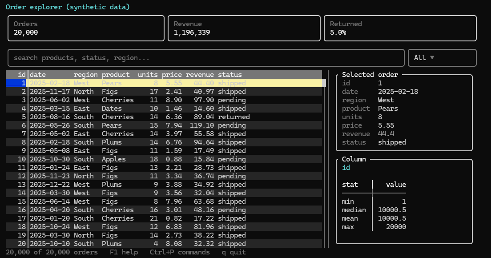
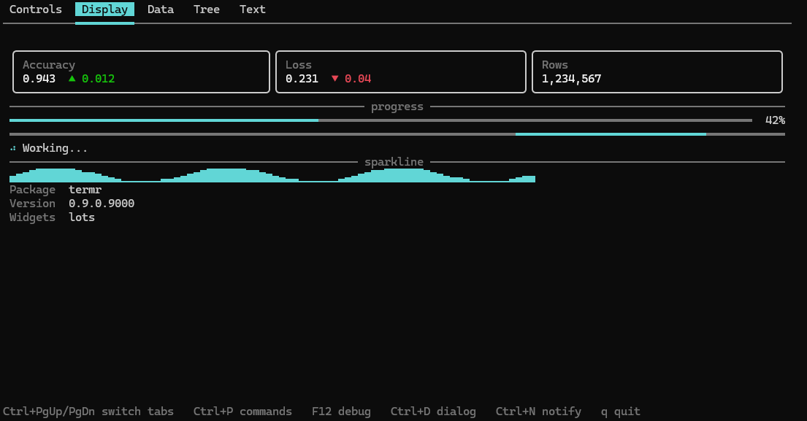

# termr

> Modern reactive terminal applications for R, with first-class support for
> data workflows.



Build modern terminal applications with R: data explorers, dashboards,
database browsers, SQL workspaces and internal analytical tools. termr combines
widgets, layouts, events, reactive state and themes in a framework that can
be tested without an interactive terminal.

R is already excellent at data, statistics and machine learning. termr adds
a terminal application layer around those workflows. A virtual framebuffer
and incremental rendering send changed cells to the terminal; application
code works with widgets and events instead of ANSI escape sequences.

## Quick start

Run this in R started inside a real terminal:

```r
library(termr)

selected <- signal(0L)
ui <- app(
  vertical(
    horizontal(
      metric("Rows", nrow(mtcars)),
      metric("Selected row", function() selected())
    ),
    data_table(mtcars, id = "cars", zebra = TRUE, header_sort = TRUE),
    button("Quit", on_press = function(event, app) app$exit())
  ),
  on("datatable.row_selected", "#cars", function(event, app) {
    selected(event$data$row)
  }),
  bind("q", "quit")
)
run(ui)
```

Use the arrow keys to move through rows, Tab to move focus, F1 for help,
and the Quit button or `q` to exit. `signal()` is part of the experimental
reactive graph; core app, layout, event and in-memory table APIs are intended
to be stable. To inspect a data frame directly, call `browse_data(mtcars)`.

## Why termr

- **Compose applications:** build a widget tree, handle typed events and
  commands, and bind displayed values to reactive state.
- **Keep data work visible:** inspect rows and records, show metrics and
  progress, and run long computations in background R workers.
- **Test the interface:** drive the event loop and renderer headlessly with
  deterministic input and time, including modal and focus behavior.

## Data workflows

`data_table()` formats and paints the visible viewport. In-memory tables
support sorting, filtering, search, selection, and resizable, hidden and
frozen columns. [Lazy table sources](docs/data-sources.md) fetch bounded pages
without loading a whole dataset into an R data frame. SQLite table and query
adapters are included; other DBI drivers can provide paging callbacks.

`sql_editor()`, `db_connection()` and `db_explorer()` compose SQL editing,
database metadata and result browsing through optional DBI packages. Query
execution and page fetches are synchronous; background workers are available
for separate analytical jobs. See [data tools](docs/data.md),
[SQL workflows](docs/sql.md) and [database explorer](docs/database-explorer.md).

```r
run_example()                  # list bundled examples
run_example("data-explorer")
run_example("data-workbench")
```

## Framework capabilities

Compose forms and dashboards with controls, tabs, split panes, scroll views,
trees, Markdown, metrics and sparklines. Add generated help, modal dialogs,
notifications and a command palette. Stylesheets and themes include
monochrome/`NO_COLOR`, high contrast and reduced motion.



This screenshot comes from the RC1 source tree and displays its package
version, `0.9.0.9000`.

Background workers and subprocesses stream output and progress with timeout,
cancellation and process cleanup. Static rendering exports text, Markdown,
HTML, SVG and JSON for scripts and optional knitr/Quarto output. These are
screen snapshots; static rendering does not start an app event loop.

## Installation

termr requires R >= 4.1 and is not on CRAN yet. Install from GitHub:

```r
remotes::install_github("41929424/termr")
```

To install the immutable release candidate exactly:

```r
remotes::install_github("41929424/termr", ref = "v1.0.0-rc1")
```

Or install a local checkout:

```r
remotes::install_local("path/to/termr")
```

The `v1.0.0-rc1` tag points to `1846527d3968cdd12fa9900bbe80a9f2a89a1a3e`.
Its source intentionally retains `Version: 0.9.0.9000`; final 1.0 has not
shipped. termr uses a small set of R runtime dependencies and keeps DBI,
RSQLite, jsonlite and knitr optional. termr itself has no compiled source code.

## Where it runs

Interactive apps need a real terminal: use `Rscript app.R` or R started
inside a terminal. Linux/macOS POSIX terminal mechanics are exercised by PTY
CI; Windows console input is read through an installed PowerShell helper
and its parser is tested in Windows CI.

For RC1, Windows real interactive console smoke and Linux through a real
`ssh -t` session were manually reported PASS. macOS real terminal, tmux,
screen and RStudio Terminal have not been manually validated. RStudio and
Positron consoles are not terminal hosts; use their terminal tabs for
interactive apps. See the [platform matrix](docs/platform-testing.md) and
[SSH guide](docs/ssh.md) for evidence and limits.

For knitr, CI and other non-TTY contexts, use [static export](docs/export.md).

## Testing

```r
pilot <- test_app(app(label("Ready")), width = 40, height = 3)
stopifnot(grepl("Ready", paste(pilot$screen_text(), collapse = "\n")))
pilot$stop()
```

`test_app()` uses the real event loop and renderer with simulated input and
time. [Testing](docs/testing.md) covers keys, mouse, paste, resize, workers
and snapshots. [Full CI run 37758703750](https://github.com/41929424/termr/actions/runs/37758703750)
passed on the RC1 commit: Ubuntu release, oldrel-1, R 4.1 and devel; macOS
and Windows release; SQL integration; Linux/macOS PTY; and Windows input.
The six R CMD check jobs reported 0 errors, 0 warnings and 0 notes.

## API stability

termr is in the 1.0 release-candidate phase. Core app/widget construction,
layout basics, events, commands, styling/themes, in-memory DataTable and
testing basics are intended to remain compatible through 1.0. The reactive
graph, workers, editor, lazy sources, database support, static export and
custom extensions remain experimental. Workflow widgets added late in the
pre-1.0 cycle also remain experimental. The complete classification is in
[API stability](docs/stability.md); see [migration notes](docs/migration-to-1.0.md)
and [NEWS](NEWS.md) for changes.

## Documentation

Start with [Getting started](docs/getting-started.md), then explore
[widgets](docs/widgets.md), [layouts](docs/layout.md), [events](docs/events.md),
[reactivity](docs/reactivity.md), [styling](docs/styling.md),
[workers](docs/workers.md) and [extensions](docs/extensions.md).
[ARCHITECTURE.md](ARCHITECTURE.md) describes the implementation for contributors.

## License

MIT
